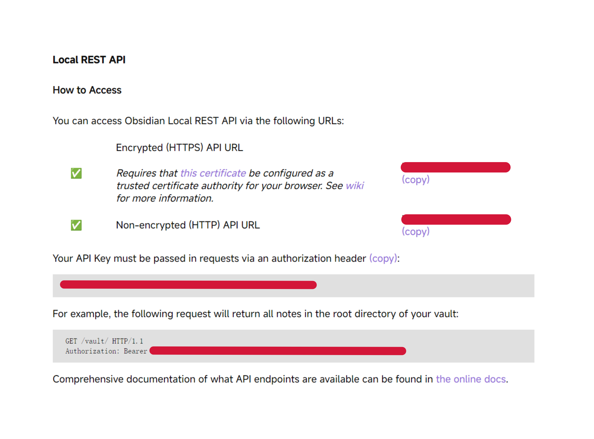

# Leetcode to Obsidian

**Leetcode2Obsidian** is a straightforward solution for saving Leetcode problems directly into your Obsidian vault in just three easy steps! This script is inspired by [leetcode-puller-obsidian](https://github.com/zimmshane/leetcode-puller-obsidian) and [leetcode-obsidian-import](https://github.com/miscde/leetcode-obsidian-import).

## Features

- Easy integration with Obsidian.
- Save Leetcode problems with a single click.
- Supports automatic note generation.

## Installation

This script relies on the Tampermonkey extension and the [obsidian-local-rest-api](https://github.com/coddingtonbear/obsidian-local-rest-api). Before you get started, ensure that you have Tampermonkey installed in your browser and that the obsidian-local-rest-api is set up in your Obsidian.

### Configure obsidian-local-rest-api

1. Copy the following two items, as you will need them later:
   - **HTTPS API URL** (If you haven't configured a certificate, use the **HTTP API URL** instead.)
   - **API Key**

### Load the script in Tampermonkey

1. Download the [save2obsidian](save2obsidian.js) file from this repository.
2. Load it into Tampermonkey.

### Create a Note

After coding a problem on Leetcode, simply right-click and select **Tampermonkey -> Leetcode to Obsidian**. The script will automatically generate your note.

> The first time you run the script, you will need to provide the API URL, API Key, and Document Path.

## Acknowledgements

- [leetcode-obsidian-import](https://github.com/miscde/leetcode-obsidian-import)
- [leetcode-puller-obsidian](https://github.com/zimmshane/leetcode-puller-obsidian)
- [turndown](https://github.com/mixmark-io/turndown)

## License

MIT
